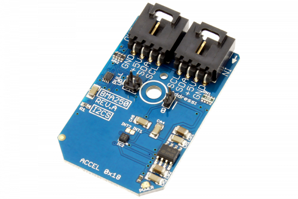

# BMA250

Bosch Sensortec’s BME250 is a triaxial, low-g acceleration sensor with digital output for consumer applications. It allows measurements of acceleration in three perpendicular axes. An evaluation circuitry (ASIC) converts the output of a micro-mechanical acceleration-sensing structure (MEMS) that works according to the differential capacitance principle.
This Device is available from www.ncd.io 

[SKU: BMA250_I2CS]

(https://store.ncd.io/product/bma250-digital-triaxial-%C2%B12g-to-%C2%B116g-acceleration-sensor-with-intelligent-on-chip-motion-triggered-interrupt-controller-i2c-mini-module/)
This Sample code can be used with Arduino.

Hardware needed to interface BMA250 sensor with Arduino

1. <a href="https://store.ncd.io/product/i2c-shield-for-arduino-nano/">Arduino Nano</a>

2. <a href="https://store.ncd.io/product/i2c-shield-for-arduino-micro-with-i2c-expansion-port/">Arduino Micro</a>

3. <a href="https://store.ncd.io/product/i2c-shield-for-arduino-uno/">Arduino uno</a>

4. <a href="https://store.ncd.io/product/dual-i2c-shield-for-arduino-due-with-modular-communications-interface/">Arduino Due</a>

5. <a href="https://store.ncd.io/product/bma250-digital-triaxial-%C2%B12g-to-%C2%B116g-acceleration-sensor-with-intelligent-on-chip-motion-triggered-interrupt-controller-i2c-mini-module/">BMA250 3-axis accelometer Sensor</a>

6. <a href="https://store.ncd.io/product/i%C2%B2c-cable/">I2C Cable</a>

BMA250:

Bosch Sensortec’s BME250 is a triaxial, low-g acceleration sensor with digital output for consumer applications. It allows measurements of acceleration in three perpendicular axes. An evaluation circuitry (ASIC) converts the output of a micro-mechanical acceleration-sensing structure (MEMS) that works according to the differential capacitance principle.

Applications:

•Display profile switching

•Pedometer/step counting

•Free fall detection

•E-Compass tilt compensation

•Drop detection for warranty logging

How to Use the BMA250 Arduino Library

The BMA250 has a number of settings, which can be configured based on user requirements.

1.g-range selection:The following command is used to select the range of 'g' as +-2 g.

           bma.setAccelRange(ACCEL_RANGE_2G);                     // 2 g
 
2.Bandwidth selection:The folowing command is used to select the bandwidth as 7.81Hz for filter acceleration data.

           bma.setAccelBandwidth(ACCEL_BANDWIDTH_7_81HZ);          // Bandwidth: 7.81 Hz
